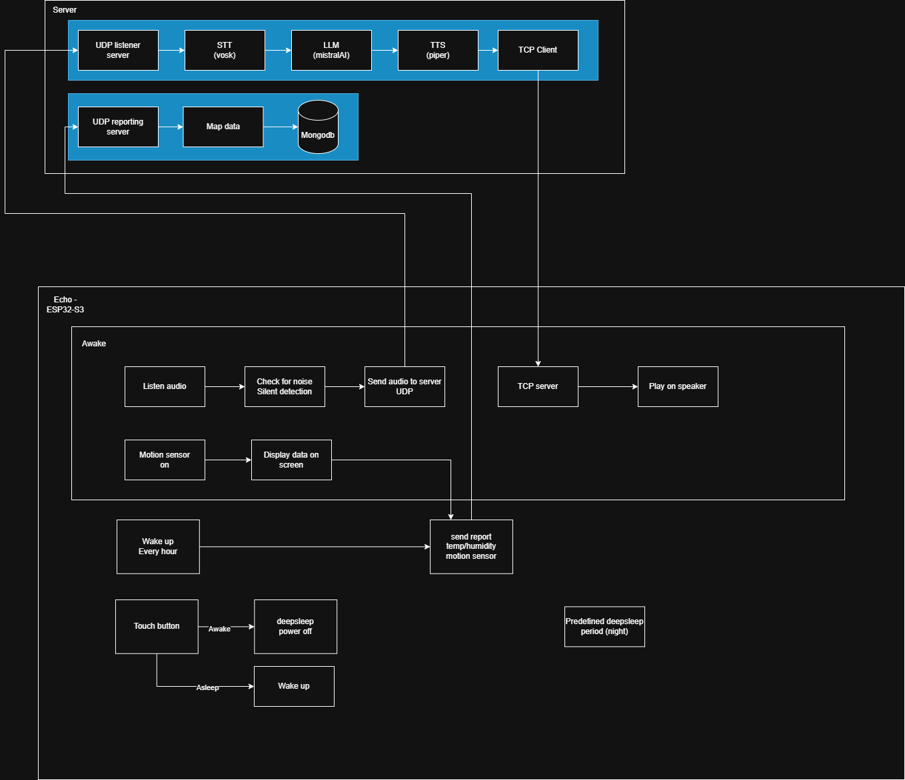

# Charlie

my own home assistant

# Ai Agent

For now it needs to be created on mistral ai website https://console.mistral.ai/build/agents

My current system prompt:
`You are an home assistant with access to different devices through function calling. Your name is Charlie.`

Agent id and mistral api key needs to be configured as env variable with `.env` in root for docker compose

```
MISTRAL_API_KEY=
AGENT_ID=
```

# Backend - nodejs-apis

## Intro

NodeJs backend to run

-   **MCP server**
-   **Rest Api**: [Swagger](http://localhost:9300/api-docs)
-   **Audio listeners servers**: websocket for browser and UDP for ESP32-S3 or other echo devices

## Environment variables

Create a .env file in "nodejs-apis" folder

```
AI_AGENTS_HOST=http://localhost:8000
DB_HOST=localhost:27017
MACVENDORS_APIKEY=(optional)
SUBNET_IP=192.168.1
TORRENT_DELUGE_HOST=(optional)
TORRENT_DELUGE_PASSWORD=(optional)
```

-   [Get a mistral API key](https://console.mistral.ai/build/agents?workspace_dialog=apiKeys)
-   [Get Mac vendors api key](https://api.macvendors.com) (optional)

# Backend - python-apis

## Intro

Python project to run models & MCP client proxy. Will provide RestApi endpoints as interface called by NodeJS project.

## Environment variables

`python-apis` folder with python fastapi is configured to run with docker therefore you can use 'docker-compose' available at root.

Refer to section "Ai Agent" for configuration.

Run in root folder:

> docker compose up ai-agents --build

This will start server on port 8000 with endpoints:

-   **/ask** : LLM call **{ question: "" }** with MCP configuration to nodejs server. `MistralAi`is the default LLM used.
-   **/tts**: TTS payload **{ text: "" }** will return blob based on Accept header. TTS uses `piper` library

# Echo devices esp32-S3

## Intro

Similar to Alexa or google echo devices, the idea is to build small device with microphone, small speaker with capability to send audio to the nodejs server for analysis and call to LLM.

The ESP32-S3 is perfect for this. Low energy consumption with WIFI capability. Also support Camera for facial recognition capabilities.


