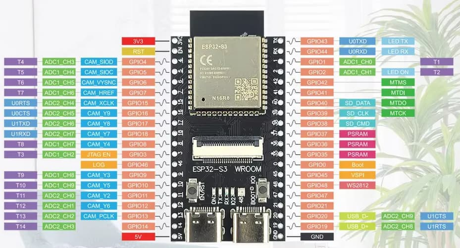

# Echo main

## Components

- ESP32-S3 WROOM N16R8 CAM OV5640
- OLED IIC 128x64 I2C SSD1306 12864

- HR-SR501 (movement sensor)
- DHT22 (temp sensor)
- touch button TTP223

- Microphone INMP441
- MAX98357 audio
- 8 Ohm 3W 8R 40MM 5.5MM

# Echo zero

## Components

- ESP32-S3 WROOM N16R8

- Microphone INMP441
- MAX98357 audio
- 8 Ohm 3W 8R 40MM 5.5MM

# Bord definition

Move [board file](boards/esp32-s3-devkitc-1-n16r8v.json) to your user folder in

> .platformio\platforms\espressif32\boards

# Versions

- v1.2: add recorded audio into PSRAM buffer before sending to server to avoid problem with network latency. Same for received audio.
    - echo-zero
    - echo-zero-screen

- v1.1: new options to set serverip and wake word accuracy through websocket
    - echo-zero
    - echo-zero-screen

- v1.0: first version with ESP32HomeAssistant library config
    - echo-zero
    - echo-zero-screen
